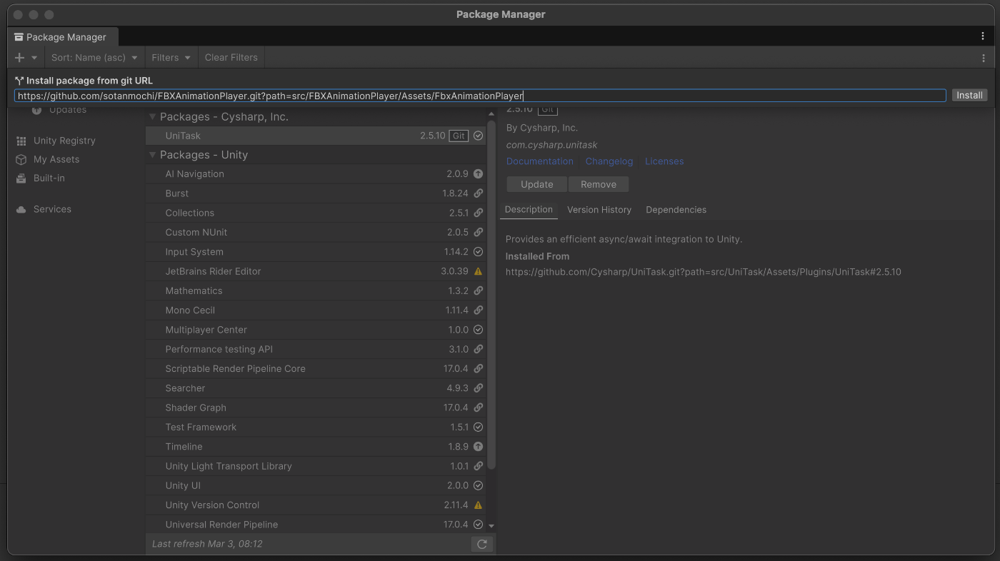

# Fbx Animation Player

[English README](./README.md)

Unity 向けのランタイム FBX アニメーションインポーター・プレイヤーです。

## デモ
- https://sotanmochi.github.io/FBXAnimationPlayer/vrm-viewer-unityweb/

## 動作確認環境
- Unity 6000.0.58f2

## 依存パッケージ
- [UniTask](https://github.com/Cysharp/UniTask)
- [Lightweight FBX Importer](https://ricardoreis.net/lightweight-fbx-importer/)
    - [Unity Asset Store](https://assetstore.unity.com/packages/tools/modeling/lightweight-fbx-importer-318963)
    - [ドキュメント](https://ricardoreis.net/fbximporter/docs/)

## インストール
Unity エディタの Package Manager からインストールできます。

1. Package Manager ウィンドウを開く
2. 「+」ボタンをクリックし「Add package from git URL」を選択
3. 以下の URL を入力: `https://github.com/sotanmochi/FBXAnimationPlayer.git?path=src/FBXAnimationPlayer/Assets/FbxAnimationPlayer#0.2.0`



Packages/manifest.json を直接編集してインストールすることもできます。
```
// Packages/manifest.json
{
  "dependencies": {
    ...
    "jp.sotanmochi.fbxanimationplayer": "https://github.com/sotanmochi/FBXAnimationPlayer.git?path=src/FBXAnimationPlayer/Assets/FbxAnimationPlayer#0.2.0",
    ...
  }
}
```

### Lightweight FBX Importer
- [Lightweight FBX Importer のセットアップ (日本語)](./src/FBXAnimationPlayer/Assets/FbxAnimationPlayer/Docs~/setup-lightweight-fbx-importer-ja.md)

## 基本的な使い方

### FBXファイルの読み込み

`FbxAnimationImporter.LoadAsync`を使ってFBXファイルを読み込むことができます。

```csharp:FbxAnimationSample.cs
using System.IO;
using System.Threading;
using Cysharp.Threading.Tasks;
using FbxAnimationPlayer;
using UnityEngine;

public class FbxAnimationSample : MonoBehaviour
{
    async void Start()
    {
        var token = this.GetCancellationTokenOnDestroy();

        var filePath = "/path/to/animation.fbx";

        // ファイルパスから読み込む場合
        var result = await FbxAnimationImporter.LoadAsync(filePath, token);

        // ストリームから読み込む場合
        // using var stream = new FileStream(filePath, FileMode.Open);
        // var result = await FbxAnimationImporter.LoadAsync(stream, token);

        if (!result.IsSuccess)
        {
            Debug.LogError(result.ErrorMessage);
            return;
        }

        // 読み込み成功 → 再生開始
        result.AnimationController.Play();
    }
}
```

### ImportResultの要素

`FbxAnimationImporter.LoadAsync`が返す`ImportResult`には3つの主要プロパティがあります。

| プロパティ | 型 | 用途 |
|---|---|---|
| `MotionActor` | `FbxMotionActor` | HumanPoseを取得して他のヒューマノイドアバターに適用 |
| `AnimationController` | `FbxAnimationController` | 再生・停止・シークなどの制御 |
| `AnimationClips` | `IReadOnlyList<AnimationClip>` | AnimationClipへの直接アクセス |

### アニメーションの再生制御

`FbxAnimationController`でアニメーションの再生を制御することができます。

```csharp
var ctrl = result.AnimationController;

// 基本的な再生制御
ctrl.Play();                // 再生（停止中なら先頭から、一時停止中なら再開）
ctrl.Pause();               // 一時停止
ctrl.Stop();                // 停止（先頭に戻る）

// シーク
ctrl.Seek(2.5f);            // 秒数指定でシーク（停止中に呼ぶと一時停止状態に遷移する）
ctrl.SeekNormalized(0.5f);  // 正規化時刻（0.0 〜 1.0）でシーク

// 再生速度・ループ
ctrl.Speed = 2.0f;          // 2倍速
ctrl.Speed = -1.0f;         // 逆再生（負値対応）
ctrl.IsLooping = false;     // ループ無効（終端で停止）

// 状態の参照
Debug.Log(ctrl.State);          // Stopped / Playing / Paused
Debug.Log(ctrl.CurrentTime);    // 現在の再生時間（秒）
Debug.Log(ctrl.Duration);       // クリップ全体の長さ（秒）
Debug.Log(ctrl.NormalizedTime); // 正規化再生時刻（0.0 〜 1.0）
```

イベントを検知することもできます。

```csharp
ctrl.StateChanged += state => Debug.Log($"状態変化: {state}");
ctrl.ClipFinished += () => Debug.Log("再生完了");
ctrl.TimeUpdated += time => slider.value = ctrl.NormalizedTime;
```

### アニメーションを他のキャラクターに適用する

`FbxMotionActor.TryGetHumanPose`で取得した`HumanPose`を[`HumanPoseHandler.SetHumanPose`](https://docs.unity3d.com/6000.0/Documentation/ScriptReference/HumanPoseHandler.SetHumanPose.html)へ渡すことによって、他のキャラクターにアニメーションを適用することができます。

事前に[`HumanPoseHandler`](https://docs.unity3d.com/6000.0/Documentation/ScriptReference/HumanPoseHandler.html)を初期化しておきます。`HumanPose`を受け取る側のキャラクターはHumanoid Avatarを持つ`Animator`が必要です。

```csharp:AvatarMotionReceiverSample.cs
using UnityEngine;

public class AvatarMotionReceiverSample : MonoBehaviour
{
    [SerializeField] private Animator _targetAnimator;

    private HumanPoseHandler _targetPoseHandler;

    void Start()
    {
        _targetPoseHandler = new HumanPoseHandler(
            _targetAnimator.avatar,
            _targetAnimator.transform
        );
    }

    void OnDestroy()
    {
        _targetPoseHandler?.Dispose();
    }
}
```

FBXファイルの読み込み後、`FbxMotionActor.TryGetHumanPose`でポーズを取得して[`HumanPoseHandler.SetHumanPose`](https://docs.unity3d.com/6000.0/Documentation/ScriptReference/HumanPoseHandler.SetHumanPose.html)で適用します。

```csharp:AvatarMotionReceiverSample.cs（続き）
private ImportResult _fbxResult;

public async void LoadAndApply(string filePath, CancellationToken token)
{
    _fbxResult = await FbxAnimationImporter.LoadAsync(filePath, token);
    if (!_fbxResult.IsSuccess || _fbxResult.MotionActor == null)
    {
        Debug.LogError(_fbxResult.ErrorMessage);
        return;
    }

    _fbxResult.AnimationController.Play();
}

void LateUpdate()
{
    if (_fbxResult == null || _fbxResult.MotionActor == null) return;

    var humanPose = new HumanPose();
    if (_fbxResult.MotionActor.TryGetHumanPose(ref humanPose))
    {
        _targetPoseHandler.SetHumanPose(ref humanPose);
    }
}
```
