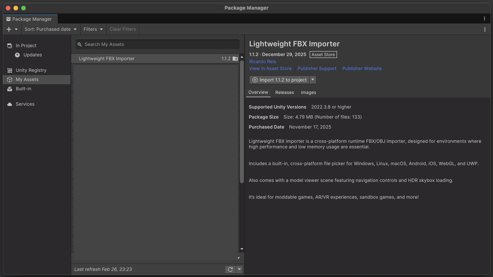
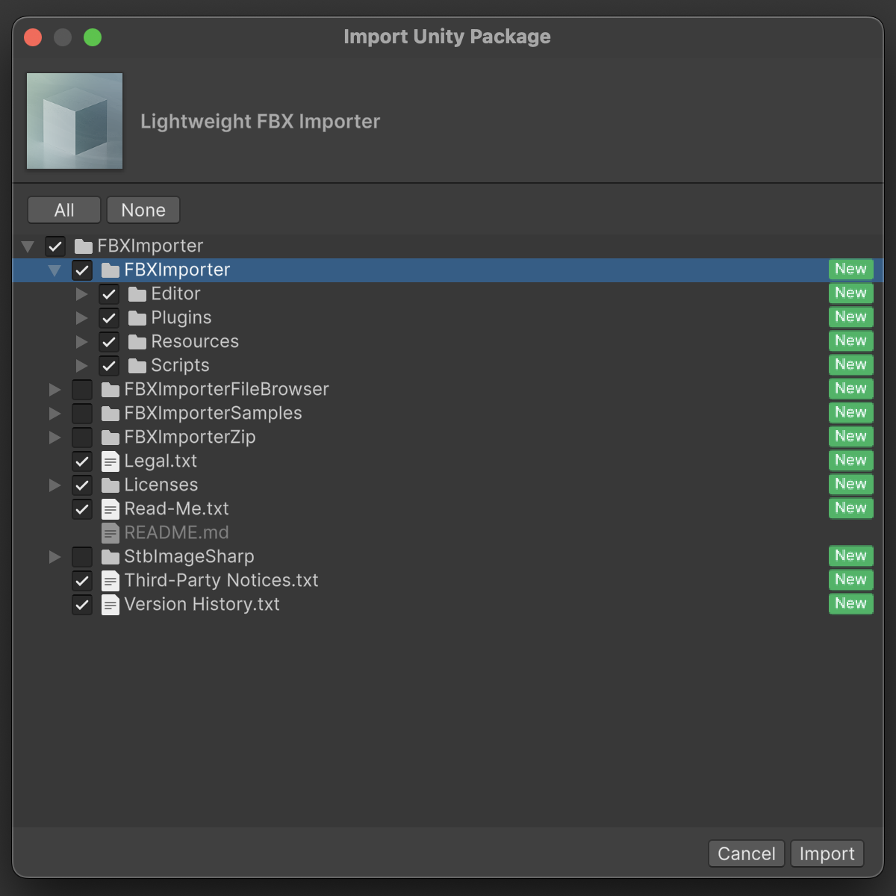

# Lightweight FBX Importer Setup

## Install Package




## Native Plugin Configuration
Lightweight FBX Importer uses a library called [ufbx](https://github.com/ufbx/ufbx) to load FBX files.
The native plugin configuration for each platform is as follows.

| Platform | File Used | Type |
|---|---|---|
| Windows | `Plugins/Windows/*/ufbx.dll` | Prebuilt |
| macOS | `Plugins/OSX/libufbx.dylib` | Prebuilt |
| Linux | `Plugins/Linux/*/libufbx.so` | Prebuilt |
| Android | `Plugins/Android/*/libufbx.so` | Prebuilt |
| iOS | `Plugins/Source/ufbx.c` | Compiled with Xcode |
| WebGL | `Plugins/Source/ufbx.c` | Compiled with Emscripten |

## Code Fix for iOS Builds
To make Lightweight FBX Importer work correctly in iOS builds,
you need to manually modify `ufbx.c` included in the imported package. Without this fix, **FBX file loading will always fail**.

The first few lines of `ufbx.c` look like this (may vary slightly depending on the ufbx version).

```c
#ifndef UFBX_UFBX_C_INCLUDED
#define UFBX_UFBX_C_INCLUDED

#if defined(UFBX_HEADER_PATH)
    #include UFBX_HEADER_PATH
#else
    #include "ufbx.h"
#endif

...
```

Add `#define UFBX_REAL_IS_FLOAT` before `#include "ufbx.h"`.

```c
#ifndef UFBX_UFBX_C_INCLUDED
#define UFBX_UFBX_C_INCLUDED

#define UFBX_REAL_IS_FLOAT // Add this line

#if defined(UFBX_HEADER_PATH)
    #include UFBX_HEADER_PATH
#else
    #include "ufbx.h"
#endif

...
```

This fix ensures that `ufbx_real` is defined as `float` (4 bytes), making the struct layout match the C# wrapper DLL, which allows FBX file loading to succeed in iOS builds.
